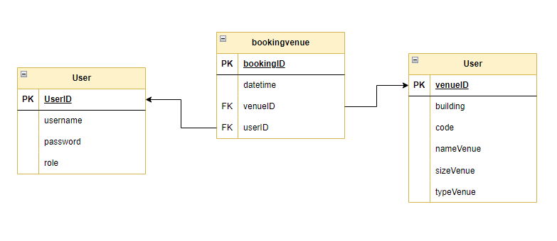

# Venue Booking System For UTHM

just forked this repository for contribution/add folder "VenueBookingSystem", not adjust the real file from owner code :)

## Flow Arhitecture 


## Database 


## (Optional) Setting Database Connection Using Xampp 
if have issue in access database, please adjust file "Database.java"
```java
    private String hostname = "localhost";
    private int port = 3306;  
    private String username = "root";
    private String password = "";
```

## Download this repository 

open the command prompt and paste this command

```shell
  git clone https://github.com/AsyraafMS/VBS.git
```

## Step to Run this Code in Eclipse

- browser the path directory/folder that you download this repository
- Lauch 
- file -> "open projects from file systems"
- click "directory" -> click "select folder" -> VBS2
- Launch XAMPP and make sure Apache and MySQL is running.
- in src/vbs_uthm -> click run "Sqlautomation.java" first to create the database, then  "mainVBS.java"


